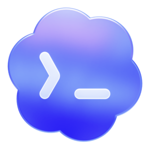

# Codex++

<p align="center">
  
</p>

<p align="center">
  <a href="README.md">中文</a> | <a href="README_EN.md">English</a> | Tiếng Việt
</p>

Codex++ là launcher và công cụ quản lý mở rộng cho Codex App. Ứng dụng không sửa trực tiếp file cài đặt gốc của Codex; thay vào đó Codex++ khởi chạy Codex từ bên ngoài và inject tính năng thông qua Chromium DevTools Protocol.

## Tính năng chính

- Launcher viết bằng Rust, chạy độc lập.
- Manager dùng Tauri + React để quản lý cấu hình, chẩn đoán, cập nhật và script người dùng.
- Inject tính năng qua CDP, không patch `app.asar` và không ghi DLL vào thư mục cài đặt Codex.
- Hỗ trợ relay injection với nhiều profile API tương thích.
- Hỗ trợ bật/tắt enhancement, plugin entry unlock, forced plugin install, xóa session, export Markdown, di chuyển project, Timeline và user scripts.
- Provider Sync giúp giữ lịch sử session sau khi đổi provider.
- Hỗ trợ tạo upstream worktree từ remote branch mới nhất.
- Có installer Windows NSIS và package macOS DMG.

## Cài đặt bản phát hành

Tải bản mới nhất tại [GitHub Releases](https://github.com/BigPizzaV3/CodexPlusPlus/releases):

- Windows: `CodexPlusPlus-*-windows-x64-setup.exe`
- macOS Intel: `CodexPlusPlus-*-macos-x64.dmg`
- macOS Apple Silicon: `CodexPlusPlus-*-macos-arm64.dmg`

Sau khi cài đặt sẽ có hai entry point:

- `Codex++`: launcher chạy im lặng, dùng để mở Codex kèm injection.
- `Codex++ Manager`: giao diện quản lý cấu hình, relay, enhancement, diagnostics, logs và update.

## Cách sử dụng: lưu và chuyển tài khoản GPT

Codex++ có thể lưu nhiều tài khoản GPT bằng cơ chế profile trong `Codex++ Manager`. Mỗi profile giữ một snapshot riêng của:

- `~/.codex/config.toml`
- `~/.codex/auth.json`

### Tạo tài khoản thứ nhất

1. Mở `Codex++ Manager`.
2. Vào `Cấu hình nhà cung cấp`.
3. Chọn profile mặc định hoặc tạo profile mới.
4. Đặt `Chế độ kết nối` là `Đăng nhập chính thức`.
5. Không tick `Mix in API KEY` nếu bạn chỉ muốn dùng tài khoản ChatGPT official.
6. Bấm `Lưu`, sau đó bấm `Đặt làm hiện tại`.
7. Mở Codex bằng `Codex++` launcher và đăng nhập tài khoản GPT thứ nhất.
8. Quay lại Manager và bấm `Lưu` để snapshot `auth.json` của tài khoản này.

### Tạo tài khoản thứ hai

1. Quay lại `Cấu hình nhà cung cấp`.
2. Bấm `Thêm nhà cung cấp`.
3. Đặt tên dễ nhận biết, ví dụ `GPT Account 2`.
4. Đặt `Chế độ kết nối` là `Đăng nhập chính thức`.
5. Không tick `Mix in API KEY`.
6. Bấm `Lưu`, sau đó bấm `Đặt làm hiện tại`.
7. Mở Codex bằng `Codex++` launcher.
8. Đăng xuất tài khoản cũ nếu cần, rồi đăng nhập tài khoản GPT thứ hai.
9. Quay lại Manager và bấm `Lưu` để snapshot `auth.json` của tài khoản thứ hai.

### Chuyển tài khoản trong Codex

Sau khi build/chạy bản mới, trong panel `Codex++` bên trong Codex sẽ có mục `Chuyển tài khoản`.

- Tài khoản đang dùng sẽ hiện `Đang dùng`.
- Tài khoản đã lưu đủ `config.toml` và `auth.json` có thể bấm để chuyển nhanh.
- Tài khoản thiếu file sẽ hiện `Thiếu file`; hãy mở Manager, đăng nhập và bấm `Lưu` lại profile đó.
- Sau khi chuyển, nếu Codex chưa đổi phiên ngay lập tức, hãy khởi động lại Codex bằng `Codex++`.

Lưu ý quan trọng: luôn chuyển tài khoản bằng `Codex++ Manager` hoặc panel `Codex++`. Không nên sửa tay `~/.codex/auth.json` khi đang dùng nhiều tài khoản, vì có thể làm snapshot bị lệch.

## Chạy từ source trên Windows

Yêu cầu môi trường:

- Node.js và npm.
- Rust toolchain.
- Tauri prerequisites cho Windows.

Chạy nhanh bằng file batch ở thư mục gốc:

```bat
run.bat
```

Menu trong `run.bat` gồm:

- `1`: chạy dev app bằng `npm run dev`.
- `2`: build release bằng `npm run build`.
- `3`: kiểm tra project bằng `npm run check` và `cargo test`.

Nếu `apps\codex-plus-manager\node_modules` chưa tồn tại, script sẽ tự chạy `npm install` trong thư mục manager trước.

Lưu ý: một số Rust test kiểm tra shell script POSIX, vì vậy trên Windows bạn nên cài Git Bash hoặc WSL và đảm bảo lệnh `sh` có trong `PATH` nếu muốn chạy đầy đủ option `Check`.

## Lệnh phát triển thủ công

```powershell
cd apps\codex-plus-manager
npm install
npm run dev
```

Kiểm tra frontend:

```powershell
cd apps\codex-plus-manager
npm run check
npm run vite:build
```

Kiểm tra Rust workspace:

```powershell
cargo fmt --check
cargo test
cargo build --release
```

Build app:

```powershell
cd apps\codex-plus-manager
npm run build
```

## Cấu trúc project

```text
apps/
  codex-plus-launcher/          Silent launcher
  codex-plus-manager/           Tauri manager
assets/inject/
  renderer-inject.js            Script enhancement inject vào Codex
crates/
  codex-plus-core/              Launch, injection, config, update, install, bridge
  codex-plus-data/              Session data, export, Provider Sync
scripts/installer/
  windows/CodexPlusPlus.nsi     Windows NSIS installer
  macos/package-dmg.sh          macOS DMG packager
```

## Vị trí dữ liệu

- Codex config: `~/.codex/config.toml`
- Codex auth state: `~/.codex/auth.json`
- Codex local database: `~/.codex/state_5.sqlite`
- Codex++ state và logs: `~/.codex-session-delete/`
- Provider Sync backups: `~/.codex/backups_state/provider-sync`

## Ghi chú

Codex++ là công cụ mở rộng bên ngoài cho Codex App. Nếu Codex App thay đổi cấu trúc giao diện hoặc cơ chế nội bộ trong các bản cập nhật sau này, script injection của Codex++ có thể cần được cập nhật tương ứng.
